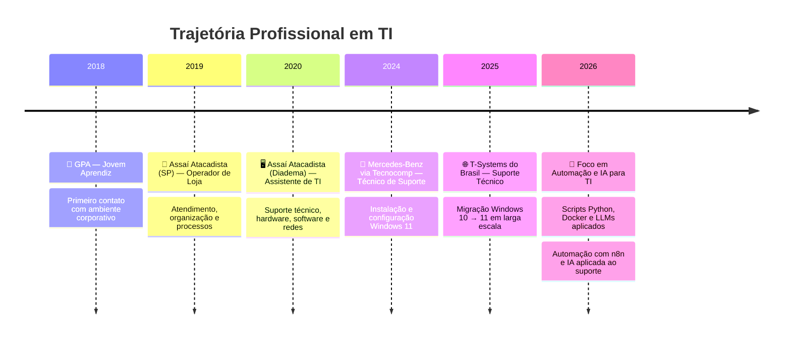

<div align="center">

<!-- Banner animado via Capsule Render -->


<!-- Typing animation -->
[](https://git.io/typing-svg)

</div>

---

## 🧠 Sobre Mim

> **Técnico de Suporte & Entusiasta de Automação** com foco em transformar rotinas manuais em fluxos inteligentes.

Trabalho na interseção entre **suporte técnico tradicional** e **automação moderna** — usando n8n, Docker e IA para elevar a qualidade e a velocidade do atendimento. Acredito que um bom técnico de TI hoje precisa não apenas resolver problemas, mas **preveni-los e automatizá-los**.

```
🖥️  Suporte N1/N2        →  Atendimento, SLA, chamados, incidentes
🤖  Automação (n8n)       →  Fluxos, notificações, status de chamados
🧠  IA para TI            →  Troubleshooting, documentação, respostas rápidas
🐳  Docker                →  Testes, padronização e validação de ambientes
🐍  Python / Shell        →  Scripts, scraping, automações leves
```

---

## 🛠️ Stack Técnica

<div align="center">

### 🔧 Suporte & Infra


### 🤖 Automação & IA


### 🌐 Desenvolvimento


### 📊 Ferramentas & Produtividade


</div>

---

## 📈 Estatísticas do GitHub

<div align="center">


</div>

<div align="center">

[](https://git.io/streak-stats)

</div>

---

## 🚀 Áreas de Atuação

<div align="center">

| 🖥️ Suporte Técnico | 🤖 Automação | 🧠 IA Aplicada | 🐳 Infraestrutura |
|:---:|:---:|:---:|:---:|
| Atendimento N1/N2 | Fluxos com n8n | Troubleshooting com IA | Containers Docker |
| Migração Windows 10→11 | Notificações automáticas | Documentação inteligente | Testes de ambiente |
| Controle de chamados/SLA | Acompanhamento de projetos | Respostas padrão com LLM | Padronização de setup |
| Instalação e configuração | Scripts Python/Shell | Consultas rápidas de proc. | Validação de aplicações |

</div>

---

## 🏆 Certificações & Formação

```yaml
Cursos & Certificações:
  - 📌 Santander X Explorer — Python / Programação           (2025)
  - 🌐 Fundação Bradesco   — HTML, CSS, JavaScript           (2023)
  - 🐍 Udemy               — Python do Básico ao Avançado    (2022)
  - 🐧 Udemy               — Linux / Shell Script            (2021)
  - 🔧 Help Byte           — Montagem, Redes e Impressoras   (2015)
```

---

## 🗺️ Minha Jornada



---

## ⚡ Projetos em Destaque

> 🔧 *Repositórios em construção — em breve com projetos reais*

| Projeto | Descrição | Tecnologias |
|---|---|---|
| 🤖 **n8n-support-flows** | Fluxos de automação para controle de chamados e notificações | n8n, Webhooks, API REST |
| 🐳 **docker-lab-env** | Ambiente Docker para testes e padronização de setup | Docker, Docker Compose |
| 🧠 **ai-support-helper** | Script que consulta IA para sugerir respostas e soluções de TI | Python, OpenAI API |
| 📊 **it-dashboard** | Dashboard de indicadores de suporte e SLA | Python, FastAPI, Power BI |
| 🪟 **win11-migration-checklist** | Checklist e scripts para migração Windows 10 → 11 | PowerShell, Batch |

---

## 💡 Filosofia de Trabalho

<div align="center">

```
╔══════════════════════════════════════════════════════════════╗
║  "O melhor chamado é aquele que nunca precisou ser aberto." ║
║                                                              ║
║       Automatize → Documente → Melhore → Repita             ║
╚══════════════════════════════════════════════════════════════╝
```

</div>

---

## 📬 Contato

<div align="center">

[](https://www.linkedin.com/in/jonathasl1m4)
[](https://github.com/JONATHAS-L1M4)
[](https://www.facebook.com/jonathas.l1m4)
[](https://www.instagram.com/jonathas.l1m4)

</div>

---

<div align="center">


*⭐ Se algo aqui foi útil, considera deixar uma estrela nos repositórios!*

</div>
